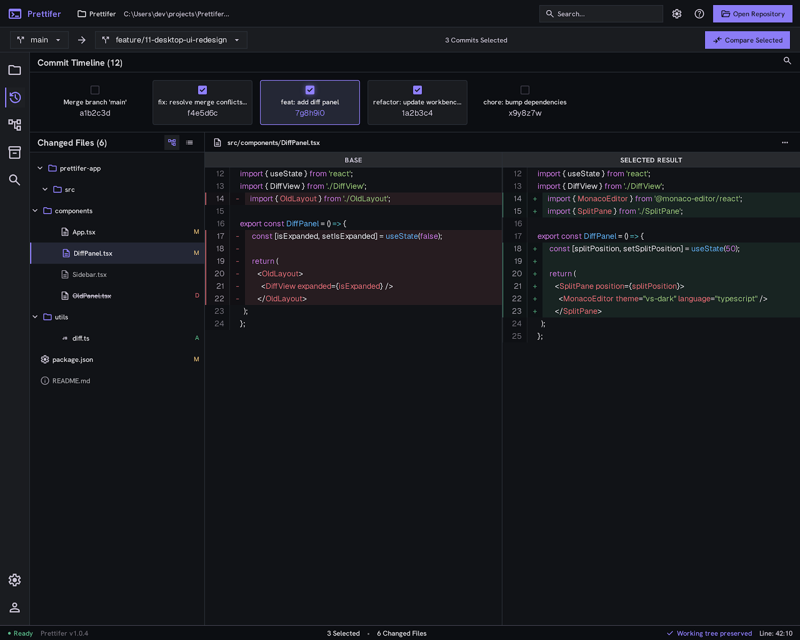
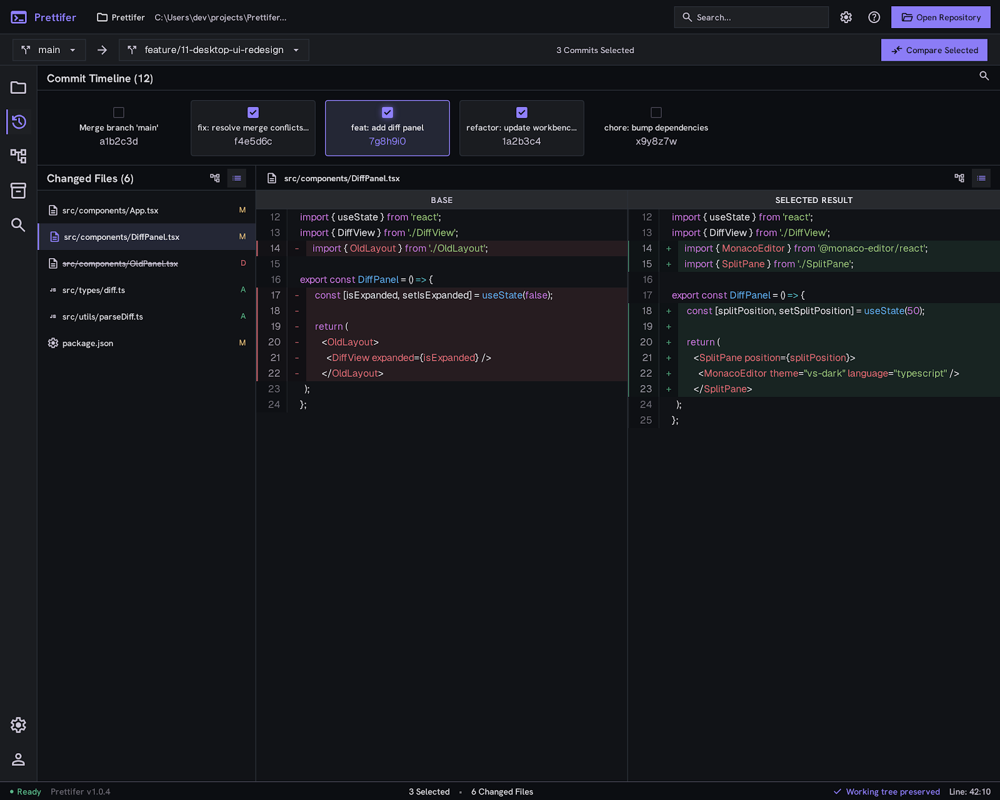

<div align="center">

# Prettifer

**Review only the commits you picked — as one combined diff.**

[](https://github.com/jjj5306/prettifer-release/releases/latest)
[](https://github.com/jjj5306/prettifer-release/releases)
[](https://github.com/jjj5306/prettifer-release/releases/latest)
[](https://github.com/jjj5306/prettifer-release/issues)

[English](README.md) · [한국어](README.ko.md)

[Download](#installation) · [Usage](#usage) · [How it works](#how-it-works) · [Troubleshooting](#troubleshooting) · [Report a bug](https://github.com/jjj5306/prettifer-release/issues/new/choose)

</div>

---

## What it does

When a branch has twenty commits and only three of them are yours to review,
Prettifer builds the final file state and a single combined diff from just
those three. Your repository is never touched.

|  | Approach | Problem |
|---|---|---|
| ❌ | Review commit by commit | A file changed several times never shows its final shape |
| ❌ | Review the whole branch diff | Changes from commits you don't care about are mixed in |
| ✅ | **Prettifer** | Pick the commits, see only their combined result |



## Installation

**Requirements**

- Windows x64
- Git `2.30+` available on `PATH`

```powershell
git --version
```

**Steps**

1. Download the latest Windows ZIP from [Releases](https://github.com/jjj5306/prettifer-release/releases/latest).
2. Extract it anywhere you like.
3. Run `prettifer.exe`.

There is no installer and no code signing yet, so Windows SmartScreen may warn
you on first launch. Verify the download with the `SHA256SUMS.txt` published
next to the ZIP:

```powershell
Get-FileHash .\prettifer-win32-x64-<version>.zip -Algorithm SHA256
```

## Usage

1. **Open Repository** — pick the local Git repository you want to review.
2. **Choose the comparison range** — set `Base branch` and `Working branch`,
   then run `Load Commit Range`.
3. **Pick commits** — tick the commits to combine. Clicking a card body
   inspects that commit without changing your selection.
4. **Build Selected Result** — run the calculation. `Cancel` stops it.
5. **Review** — choose a file in `Changed Files` and compare the base against
   the selected result.

Commit History runs oldest to newest, left to right.

> [!IMPORTANT]
> Set `Base` to the branch your working branch actually forked from. If your
> branch came off `release/2026.6` but you pick `master` as the base, every
> commit added to `release/2026.6` since the two branches diverged shows up
> too. That is correct Git behaviour, just probably not the range you wanted.

## Features

| Feature | Description |
|---|---|
| Non-contiguous selection | Pick several commits that are not next to each other |
| Combined result | Applies only the selected commits, oldest first |
| Tree / List view | Browse changed files as a folder tree or as full paths |
| Folder collapsing | Collapse and expand folders; single-child paths are joined into one row |
| Side-by-side diff | Base on the left, selected result on the right |
| Added files | New files show their whole content as added, with no empty base pane |
| Resizable panes | Drag the pane and in-diff dividers, or use arrow keys, Home and End |
| Binary files | Detected and reported instead of being rendered as text |
| Accessibility | Keyboard operation, visible focus, 200% zoom and high contrast |

<details>
<summary>List view screenshot</summary>



</details>

## How it works

Every request runs in a temporary local clone that is isolated from your
repository.

```text
1. Resolve the comparison base from the merge-base of Base and Working
2. Create an isolated temporary local clone with no checkout
3. Apply the safe Git config and attributes that affect file content
4. Prepare only the paths the selected commits touch
5. Fall back to a full checkout when repository merge/filter drivers need it
6. Apply the selected commits, oldest first
7. Collect content and diffs from the base Git objects and the final index
8. Remove that request's temporary directory on success, failure or cancel
```

Temporary files are written to disk while the calculation runs. If cleanup
fails the app reports the leftover path so you can close whatever is holding
it and remove it yourself.

**Your repository keeps** its current branch and HEAD, staged, unstaged and
untracked files, local Git config, and any other registered worktrees.

## Limitations

| Area | Current behaviour |
|---|---|
| Merge commits | Shown as `Merge commit · unavailable` and excluded from selection |
| Commits across branches | Selection works inside one linear history |
| Conflicting files | The calculation fails and names the prerequisite commits to add |
| Change grouping | Folder tree and full path list only |
| Per-file commit history | Only the combined result diff is available |
| Rename detection | Old and new paths appear as a delete and an add |
| Root commit comparison | Not supported |
| macOS · Linux | Windows builds only |
| Code signing · auto update | Not provided |

The build ships an automation boundary used by the project's own end-to-end
tests. It stays inactive unless `PRETTIFER_E2E=1` is set explicitly.

## Troubleshooting

<details>
<summary><b>Git executable not found</b></summary>

```powershell
git --version
```

Confirm Git `2.30+` is installed and resolvable from the current user's `PATH`,
then restart the app.

</details>

<details>
<summary><b>More commits listed than expected</b></summary>

Check the base branch. Inspect the fork point and the resulting range:

```powershell
git merge-base <base> <working>
git log --oneline --first-parent <base>..<working>
git rev-parse --abbrev-ref <working>@{upstream}
```

The branch reported by the last command is usually the base you want.

</details>

<details>
<summary><b>A selected change could not be applied</b></summary>

The commit likely depends on a file created or changed by an earlier commit you
did not select. Add the prerequisite commits the message names and run again.

</details>

<details>
<summary><b>Lock, permission or disk space errors</b></summary>

Close other Git operations on the repository, then check access rights and free
disk space before retrying.

</details>

<details>
<summary><b>Calculation or cleanup takes too long</b></summary>

Use `Cancel` to stop the calculation. If a temporary path cleanup error is
reported, close the program using that path and remove it.

</details>

## Report a bug or request a feature

Open an [issue](https://github.com/jjj5306/prettifer-release/issues/new/choose)
using one of the forms.

A bug report is much easier to act on with the Prettifer version, the Windows
version, `git --version` output, the steps you took (which Base and Working you
chose, how many commits you selected), and the on-screen error text.

> [!CAUTION]
> Remove repository paths, branch names, commit messages and source code from
> screenshots and error text before posting. This tracker is public.

## License

This repository does not carry a license file yet. Ask the repository owner
about use and redistribution terms.
